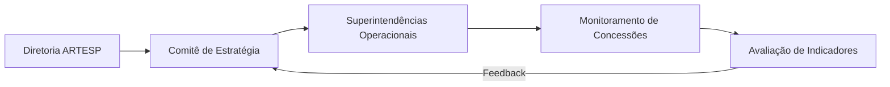

# Estrutura Base de Apresentação Slidev com Deploy no GitHub Pages Implementation Plan

> **For agentic workers:** REQUIRED SUB-SKILL: Use superpowers:subagent-driven-development (recommended) or superpowers:executing-plans to implement this plan task-by-task. Steps use checkbox (`- [ ]`) syntax for tracking.

**Goal:** Configurar a estrutura básica de um repositório para apresentações Slidev com suporte a pastas isoladas de insumo (`inputs/`), automação de CI/CD para GitHub Pages e versionamento conectado ao repositório remoto `dorettoartesp/artest`.

**Architecture:** Projeto Node.js leve utilizando Slidev (`@slidev/cli`) para geração estática de slides em Markdown, com pipeline GitHub Actions que constrói o site estático usando base path `/artest/` e publica via GitHub Pages. Uma pasta `inputs/` isolada no `.gitignore` permite clonar outros repositórios e armazenar insumos para que uma LLM externa gere o conteúdo final.

**Tech Stack:** Node.js (v22+), npm, Slidev (`@slidev/cli`, `@slidev/theme-default`), GitHub Actions (`actions/deploy-pages@v4`, `actions/upload-pages-artifact@v3`), Git.

## Global Constraints

- Repositório remoto configurado como `https://github.com/dorettoartesp/artest.git`.
- Branch padrão: `main`.
- Base path de build obrigatório: `/artest/` (para compatibilidade com `https://dorettoartesp.github.io/artest/`).
- O diretório `inputs/` deve ser ignorado no Git para qualquer conteúdo interno, exceto seus arquivos de instrução (`.gitkeep` e `README.md`).
- Sem placeholders: todos os comandos e arquivos devem conter código executável e completo.

---

### Task 1: Scaffolding do Projeto, Dependências e Configuração do Gitignore

**Files:**
- Create: `package.json`
- Create: `.gitignore`
- Create: `inputs/.gitkeep`
- Create: `inputs/README.md`
- Create: `public/favicon.svg`

**Interfaces:**
- Produz: Ambiente Node.js pronto com dependências Slidev instaladas e estrutura de isolamento `inputs/`.

- [ ] **Step 1: Criar o arquivo `.gitignore`**

```gitignore
node_modules
dist
*.local
.DS_Store

# Ignore all user inputs/cloned repos, keep template files
inputs/*
!inputs/.gitkeep
!inputs/README.md
```

- [ ] **Step 2: Criar o arquivo `package.json`**

```json
{
  "name": "artesp-estrategia-slides",
  "version": "1.0.0",
  "private": true,
  "description": "Apresentação em slides para ARTESP Estratégia usando Slidev",
  "scripts": {
    "dev": "slidev --open",
    "build": "slidev build --base /artest/",
    "export": "slidev export"
  },
  "devDependencies": {
    "@slidev/cli": "^52.1.0",
    "@slidev/theme-default": "^0.25.0"
  }
}
```

- [ ] **Step 3: Criar arquivos base do diretório `inputs/` e asset público**

Criar `inputs/.gitkeep` vazio e `inputs/README.md`:

```markdown
# Diretório de Insumos (`inputs/`)

Coloque aqui repositórios clonados, arquivos Markdown, notas ou documentos de referência.
Este diretório está configurado no `.gitignore` (`inputs/*`), portanto o conteúdo adicionado aqui não será comitado no repositório dos slides, evitando conflitos de Git.

A inteligência artificial poderá ler os arquivos aqui presentes para gerar o conteúdo do `slides.md`.
```

Criar `public/favicon.svg`:

```svg
<svg xmlns="http://www.w3.org/2000/svg" viewBox="0 0 100 100">
  <rect width="100" height="100" rx="20" fill="#003366"/>
  <text x="50" y="62" font-size="34" font-weight="bold" fill="#ffffff" text-anchor="middle" font-family="sans-serif">ART</text>
</svg>
```

- [ ] **Step 4: Instalar as dependências via npm e testar o isolamento do `.gitignore`**

Executar:
```bash
npm install
touch inputs/test_file.txt
git status --porcelain
```
Verificar:
- `npm install` conclui com código 0 e cria `package-lock.json`.
- `inputs/test_file.txt` NÃO aparece na saída de `git status` (provando que o `.gitignore` funciona).
- Limpar o arquivo de teste: `rm inputs/test_file.txt`.

- [ ] **Step 5: Commit das configurações e scaffolding inicial**

```bash
git add .gitignore package.json package-lock.json inputs/ public/
git commit -m "chore: scaffold project structure, dependencies, and inputs isolation"
```

---

### Task 2: Criação do Template de Slides (`slides.md`) e Documentação Principal (`README.md`)

**Files:**
- Create: `slides.md`
- Create: `README.md`

**Interfaces:**
- Consome: Dependências Slidev da Task 1.
- Produz: Slides base corporativos prontos para visualização e compilação em `dist/`.

- [ ] **Step 1: Criar o arquivo `slides.md`**

```markdown
---
theme: default
background: https://cover.sli.dev
title: ARTESP - Estratégia
info: |
  ## Apresentação Estratégica - ARTESP
  Documento e apresentação gerados via Slidev.
class: text-center
drawings:
  persist: false
transition: slide-left
mdc: true
---

# ARTESP
### Planejamento Estratégico e Diretrizes

Apresentação Institucional & Regulamentação

<div class="pt-12">
  <span class="px-3 py-1 rounded bg-blue-900 text-white text-sm">Agência de Transporte do Estado de São Paulo</span>
</div>

---
layout: default
---

# Agenda

Visão geral dos tópicos abordados nesta apresentação:

<v-clicks>

- **1. Contexto & Cenário Atual:** Panorama do setor de transportes e concessões
- **2. Diretrizes Estratégicas:** Pilares institucionais e objetivos prioritários
- **3. Governança e Regulação:** Metodologia de acompanhamento e fiscalização
- **4. Metas e Indicadores:** Principais entregas e cronograma de execução
- **5. Próximos Passos:** Ações imediatas e alinhamentos operacionais

</v-clicks>

---
layout: two-cols
---

# Pilares Estratégicos

Diretrizes centrais para o ciclo de gestão

::left::
### Eficiência Operacional
- Modernização de processos regulatórios
- Integração de dados em tempo real
- Foco na segurança viária e pontualidade

::right::
### Sustentabilidade & Inovação
- Estímulo à descarbonização no transporte
- Adoção de novas tecnologias de monitoramento
- Transparência ativa e foco no usuário

---
layout: default
---

# Governança e Fluxo Decisório

Fluxo estruturado de deliberação e acompanhamento:



---
layout: center
class: text-center
---

# Obrigado!

### ARTESP - Estratégia & Inovação
Para dúvidas e alinhamentos: contato@artesp.sp.gov.br
```

- [ ] **Step 2: Criar o arquivo `README.md`**

```markdown
# Apresentação Estratégica ARTESP (Slidev)

Este repositório contém a infraestrutura e os slides da apresentação institucional da ARTESP, construída com [Slidev](https://sli.dev/) e publicada automaticamente no **GitHub Pages**.

🔗 **Apresentação Online:** `https://dorettoartesp.github.io/artest/`

---

## 🚀 Como Executar Localmente

### Pré-requisitos
- Node.js v20+ ou v22+
- npm instalado

### Instalação
```bash
npm install
```

### Iniciar Servidor de Apresentação (com hot-reload)
```bash
npm run dev
```
Acesse `http://localhost:3030` no navegador.

### Gerar Build Estática
```bash
npm run build
```
Os arquivos prontos para publicação serão gerados no diretório `dist/` com o prefixo `/artest/`.

---

## 📂 Como Adicionar Conteúdo de Apoio (`inputs/`)

A pasta `inputs/` está configurada para receber materiais externos sem interferir no controle de versão Git:
1. Clone repositórios necessários dentro de `inputs/` (`git clone ... inputs/repo-nome`).
2. Copie relatórios, arquivos `.md`, notas ou documentos para `inputs/`.
3. Utilize uma LLM para analisar os arquivos contidos em `inputs/` e estruturar ou editar o arquivo `slides.md`.

---

## 🌐 Publicação Contínua (CI/CD)

O pipeline do GitHub Actions (`.github/workflows/deploy.yml`) compila os slides e atualiza o GitHub Pages automaticamente a cada `git push` na branch `main`.
```

- [ ] **Step 3: Testar o build estático do Slidev**

Executar:
```bash
npm run build
```
Verificar:
- Comando finaliza com status 0.
- Diretório `dist/` é gerado contendo `index.html` e assets compilados.
- Validar se `index.html` contém referências com `/artest/` (base URL configurada).

- [ ] **Step 4: Commit dos slides e documentação**

```bash
git add slides.md README.md
git commit -m "feat: add initial slides template and project documentation"
```

---

### Task 3: Pipeline de CI/CD para GitHub Pages e Verificação do Repositório Git

**Files:**
- Create: `.github/workflows/deploy.yml`

**Interfaces:**
- Consome: Scripts de build do `package.json`.
- Produz: Automação completa de publicação no GitHub Pages via GitHub Actions.

- [ ] **Step 1: Criar o arquivo de workflow `.github/workflows/deploy.yml`**

```yaml
name: Deploy Slidev to GitHub Pages

on:
  push:
    branches: [main]
  workflow_dispatch:

permissions:
  contents: read
  pages: write
  id-token: write

concurrency:
  group: 'pages'
  cancel-in-progress: false

jobs:
  deploy:
    environment:
      name: github-pages
      url: ${{ steps.deployment.outputs.page_url }}
    runs-on: ubuntu-latest
    steps:
      - name: Checkout
        uses: actions/checkout@v4

      - name: Setup Node.js
        uses: actions/setup-node@v4
        with:
          node-version: 22
          cache: 'npm'

      - name: Install dependencies
        run: npm ci

      - name: Build slides
        run: npm run build

      - name: Upload artifact
        uses: actions/upload-pages-artifact@v3
        with:
          path: dist

      - name: Deploy to GitHub Pages
        id: deployment
        uses: actions/deploy-pages@v4
```

- [ ] **Step 2: Validar a sintaxe do YAML e integridade dos arquivos**

Executar:
```bash
node -e "const fs = require('fs'); console.log('Checking YAML size:', fs.statSync('.github/workflows/deploy.yml').size)"
```
Verificar:
- Arquivo existe e tem tamanho superior a 0 bytes.

- [ ] **Step 3: Commit do workflow de CI/CD**

```bash
git add .github/workflows/deploy.yml
git commit -m "ci: add GitHub Actions workflow for automatic Pages deployment"
```

- [ ] **Step 4: Verificação final de status e configuração remota do Git**

Executar:
```bash
git branch --show-current
git remote -v
git log --oneline -n 5
git status
```
Verificar:
- Branch atual é `main`.
- Remote `origin` aponta para `https://github.com/dorettoartesp/artest.git`.
- Working tree está limpa (`working tree clean`).
