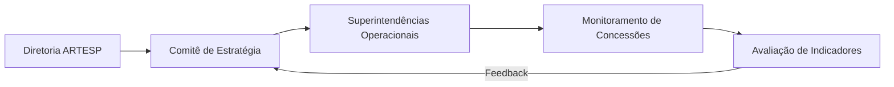

# ARTESP
### Planejamento Estratégico e Diretrizes

Apresentação Institucional & Regulamentação

  Agência de Transporte do Estado de São Paulo

---
layout: default
---

# Agenda

Visão geral dos tópicos abordados nesta apresentação:

<v-clicks>

- **1. Contexto & Cenário Atual:** Panorama do setor de transportes e concessões
- **2. Diretrizes Estratégicas:** Pilares institucionais e objetivos prioritários
- **3. Governança e Regulação:** Metodologia de acompanhamento e fiscalização
- **4. Metas e Indicadores:** Principais entregas e cronograma de execução
- **5. Próximos Passos:** Ações imediatas e alinhamentos operacionais

</v-clicks>

---
layout: two-cols
---

# Pilares Estratégicos

Diretrizes centrais para o ciclo de gestão

::left::
### Eficiência Operacional
- Modernização de processos regulatórios
- Integração de dados em tempo real
- Foco na segurança viária e pontualidade

::right::
### Sustentabilidade & Inovação
- Estímulo à descarbonização no transporte
- Adoção de novas tecnologias de monitoramento
- Transparência ativa e foco no usuário

---
layout: default
---

# Governança e Fluxo Decisório

Fluxo estruturado de deliberação e acompanhamento:

---
layout: center
class: text-center
---

# Obrigado!

### ARTESP - Estratégia & Inovação
Para dúvidas e alinhamentos: contato@artesp.sp.gov.br
